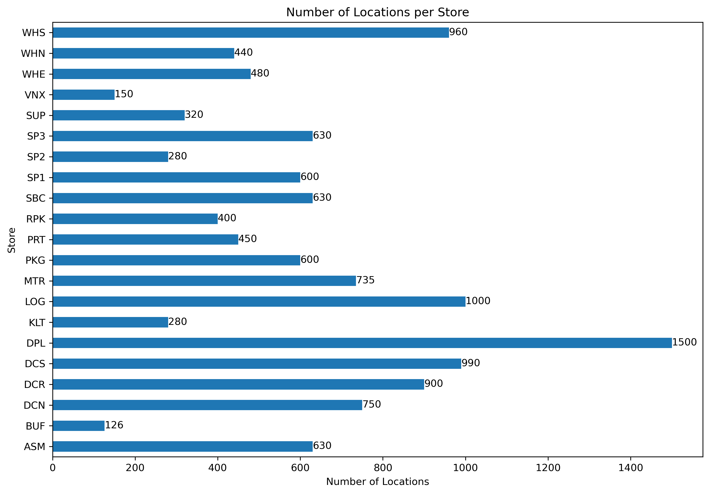
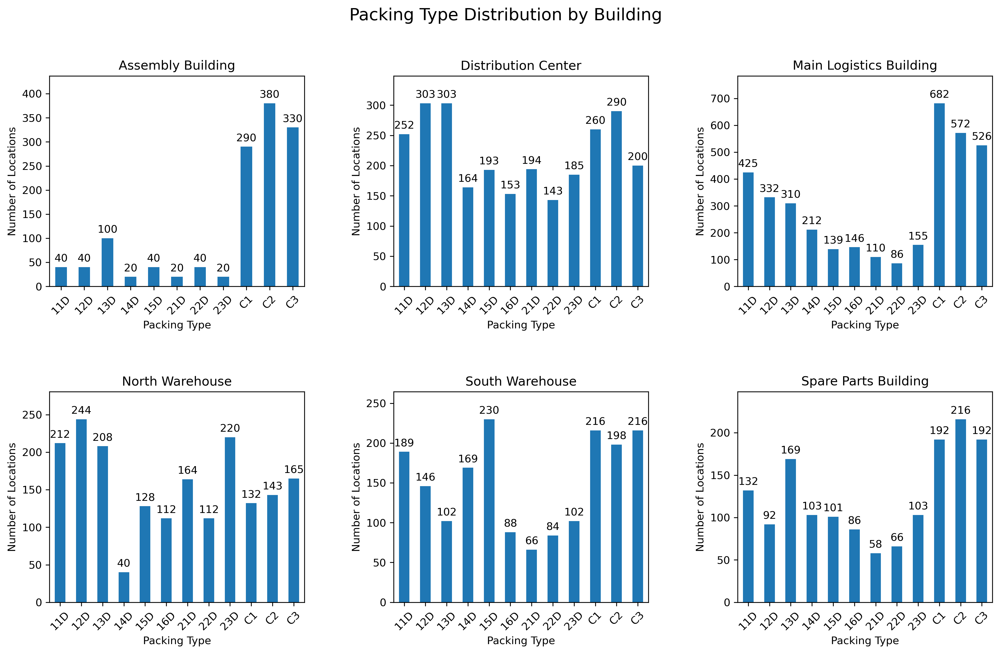
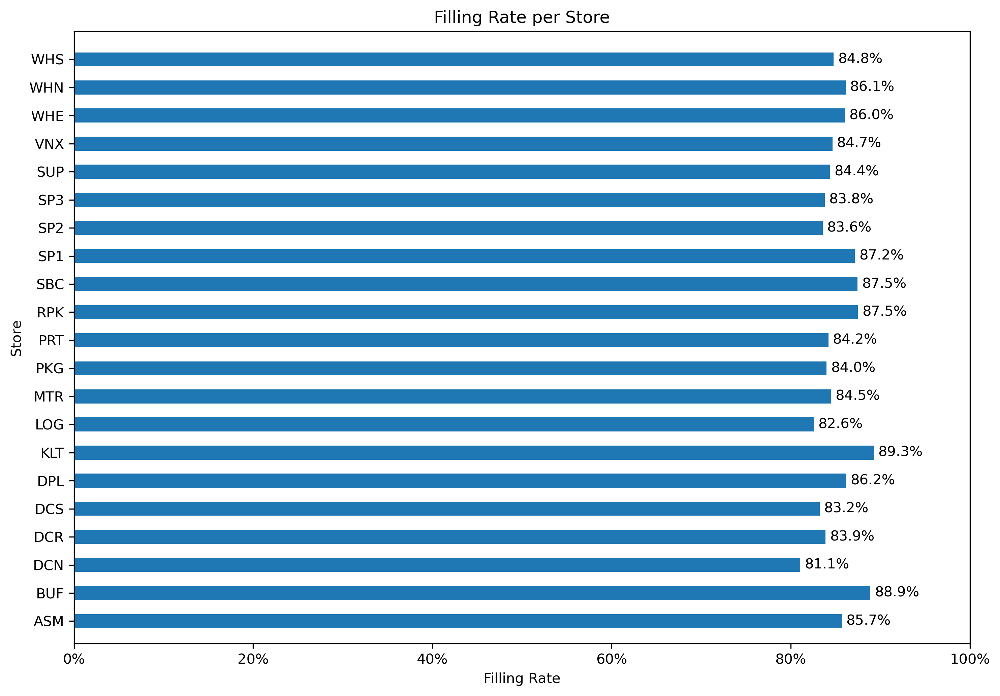

# Warehouse Capacity Analysis

## Overview

This project analyzes warehouse capacity and storage utilization using a simulated logistics database.

The purpose of the project is to demonstrate a complete data-analysis workflow, from designing and populating a relational database to querying, analyzing, and visualizing logistics data with Python.

The project combines **MySQL, SQL, Python, Pandas, Matplotlib, and Jupyter Notebook**.

> **Note:** The data in this project is simulated and created specifically for analytical and portfolio purposes. It does not represent real company data.

---

## Objective

The objective is to analyze warehouse capacity across different buildings and storage areas and identify differences in:

* Number of storage locations
* Storage and packing types
* Distribution of packing types across buildings
* Location utilization and filling rates

The analysis is intended to provide a structured view of warehouse capacity and demonstrate how operational logistics data can be transformed into useful insights.

---

## Key Questions

The analysis focuses on the following questions:

1. How many locations are there in each storage?
2. How many stores are there in each building?
3. How are packing types distributed across different buildings?
4. What is the filling rate in each storage?

---

## Project Workflow

The project follows a complete data-analysis workflow:

```text
MySQL Database
      │
      ▼
SQL Queries
      │
      ▼
Python / Pandas
      │
      ▼
Data Transformation & Analysis
      │
      ▼
Matplotlib Visualizations
      │
      ▼
Warehouse Capacity Insights
```

The database contains simulated warehouse structures including buildings, storage areas, storage configurations, locations, packing types, and location status.

---

## Database Structure

The MySQL database consists of four main tables:

### Building

Contains information about the warehouse buildings.

* Building address
* Building name
* Building shortcut

### Areas

Contains storage areas and their relationships to buildings and other areas.

* Area address
* Storage name
* Zone address
* Building address

### Storage_configuration

Defines the physical configuration of each storage area.

* Number of racks
* Number of columns
* Number of shelves

### Locations

Contains individual warehouse locations generated from the storage configuration.

* Location address
* Packing type
* Location category
* Location status

Location status is simulated as:

* `O` — Occupied
* `F` — Free

The simulated dataset uses an approximately **85% occupied / 15% free** distribution.

---

## Data Generation

The project includes Python scripts that generate the warehouse location data based on the configured storage dimensions.

For example, a storage configuration containing:

```text
20 racks
15 columns
5 shelves
```

produces:

```text
20 × 15 × 5 = 1,500 locations
```

Packing types are generated according to storage-specific rules.

### Box storage

Box storage areas use:

```text
C1
C2
C3
```

### Pallet storage

Pallet storage areas use:

```text
11D
12D
13D
14D
15D
16D

21D
22D
23D
```

Additional rules are applied to ensure that certain pallet types are only assigned to suitable shelf levels.

---

## Analysis

The analysis is performed using Python, Pandas and Matplotlib in Jupyter Notebook.

### 1. Number of Locations per Storage

The first analysis compares the total number of warehouse locations available in each storage area.

This highlights the significant differences in physical capacity between the storage areas.

For example, the simulated dataset contains:

```text
DPL    1,500
DCS      990
WHS      960
DCR      900
...
```

This provides an overview of which storage areas contribute the most capacity to the warehouse network.

---

### 2. Number of Stores per Building

The second analysis compares how many storage areas belong to each building.

This provides an overview of how warehouse storage capacity is distributed geographically across the different buildings.

---

### 3. Packing Type Distribution by Building

The third analysis examines the distribution of packing types within each building.

Separate charts are used for each building to make differences between packing types easier to identify.

This analysis also highlights the difference between buildings containing primarily box storage and buildings containing pallet storage.

---

### 4. Filling Rate per Storage

The final analysis calculates the filling rate for each storage area.

The filling rate is calculated as:

```text
Filling Rate = Occupied Locations / Total Locations
```

The result makes it possible to compare utilization between storage areas regardless of their physical size.

This is particularly useful because a storage area with a large number of locations is not necessarily more highly utilized than a smaller storage area.

---

## Visualizations

### Number of Locations per Store



### Packing Types per Building



### Filling Rate per Store



---

## Technologies

The project uses:

* **Python**
* **Pandas**
* **Matplotlib**
* **MySQL**
* **SQL**
* **Jupyter Notebook**
* **SQLAlchemy**
* **MySQL Connector/Python**
* **python-dotenv**

---

## Project Structure

```text
warehouse-capacity-analysis/
│
├── notebooks/
│   └── warehouse_capacity_analysis.ipynb
│
├── sql/
│   ├── create_tables.sql
│   └── insert_values.sql
│
├── src/
│   ├── generate_areas.py
│   └── generate_locations.py
│
├── .env.example
├── .gitignore
├── requirements.txt
└── README.md
```

---

## How to Run

### 1. Clone the repository

```bash
git clone https://github.com/FilipMichielus/warehouse-capacity-analysis.git
cd warehouse-capacity-analysis
```

### 2. Create the database

Open MySQL Workbench or another MySQL client and run:

```text
sql/create_tables.sql
```

Then populate the initial warehouse structure using:

```text
sql/insert_values.sql
```

### 3. Configure database credentials

Create a `.env` file based on `.env.example` and add your local MySQL connection details.

Example:

```text
DB_HOST=localhost
DB_USER=your_username
DB_PASSWORD=your_password
DB_NAME=logistics_data
```

The `.env` file is excluded from Git using `.gitignore` so that database credentials are not committed to the repository.

### 4. Generate warehouse data

Run the Python scripts in `src/` to generate the simulated warehouse locations.

### 5. Run the analysis

Open the Jupyter Notebook in `notebooks/` and run the analysis cells.

---

## Key Takeaways

The analysis demonstrates how warehouse data can be used to evaluate both **physical capacity and operational utilization**.

The project shows that:

* Storage areas can differ significantly in their available capacity.
* The number of storage areas varies between buildings.
* Packing types are distributed differently depending on the building and storage configuration.
* Filling rates can vary between individual storage areas even when the overall warehouse utilization is relatively similar.

The project can be extended with additional analyses such as filling rate by packing type, capacity by building, free capacity, and comparisons between pallet and box storage.

---

## Purpose

This project was created as a portfolio project to demonstrate practical skills in:

**SQL → Data Extraction → Python → Pandas → Data Analysis → Data Visualization**

with a focus on **logistics and warehouse operations**.
